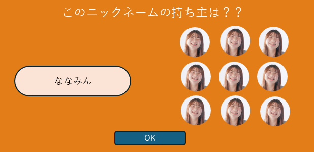
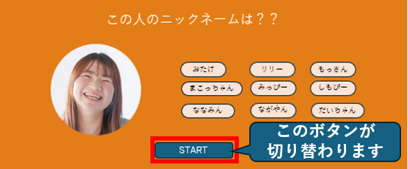

## オフィス選択画面

### イメージ

### 画面概要説明

- 新入社員の方が直面する”ニックネームと顔がなかなか覚えられない問題”を解決するために開発する『この人だぁーれ？』ゲームのプレー画面
- 2つのモードを選択してゲーム可能
  - 顔写真を見て、ニックネームを回答するモード

   - ニックネームを見て、顔写真を回答するモード

- 部署選択
  - 全部署表示されるが、今バージョンはシステム開発部のみ選択可能とする    
- ゲーム開始前[START] → ゲーム中[OK] の様に、ボタンの表示が遷移する

- 回答が正解だった場合は、以下のダイアログが表示される

- 回答が不正解だった場合は、以下のダイアログが表示される

- すべての回答が終了した場合は、以下のダイアログが表示される

- 回答終了後、[FINISH]ボタンを押下すると、成績一覧表とグラフが表示される

### 画面項目定義

| No  | 項目名                                                         | 項目種別    | 備考                                       |
| --- | -------------------------------------------------------------- | ------------| ------------------------------------------ |
| 1   | どっちで回答する？                                             | ラベル      |                                            |
| 2   | ニックネームボタン                                             | ボタン      |                                            |
| 3   | 顔ボタン                                                       | ボタン      |                                            |
| 4   | 部署選択                                                       | ラジオボタン| システム開発部以外は選択できないようにする |
| 5   | 問題用顔画像                                                   | 画像        | 重複がないように、ランダムで表示           |
| 6   | 回答用顔画像                                                   | 画像        | システム開発部全員の顔写真を表示する       |
| 7   | 問題用ニックネーム                                             | ラベル      | 重複がないように、ランダムで表示           |
| 8   | 回答用ニックネーム                                             | ボタン      | システム開発部全員のニックネームを表示する |
| 9   | START,OK                                                       | ボタン      |                                            |
| 10  | 成績一覧                                                       | 表          |                                            |
| 11  | 成績一覧                                                       | グラフ      |                                            |
| 12  | ダイアログ（ラベル）                                           | ダイアログ  |（正解時）正解！！ （不正解時）不正解！！ （終了時）お疲れさまでした^^|
| 13  | ダイアログ（ラベル）                                           | ダイアログ  |（正解時）〇 （不正解時）× （終了時）あなたの正解数は〇問/□問 おめでとうございます！|
| 14  | ダイアログ（ボタン）                                           | ダイアログ  |（正解・不正解時）次の問題へ （終了時）閉じる                         |

### 画面イベント

| No  | 項目 No  | 概要                               | 備考                                                                 |
| --- | -------- | ---------------------------------- | -------------------------------------------------------------------- |
| 1   | 画面初期 | この人だぁーれゲーム               |                                                                      |
| 2   | 2        | ニックネーム回答ゲーム             | 顔写真を見て、ニックネームを回答するモード                           |
| 3   | 3        | 顔回答ゲーム                       | ニックネームを見て、顔写真を回答するモード                           |
| 4   | 4        | 問題がセットされる                 | 今バージョンではシステム開発部のみ対象                               |
| 5   | 9        | ゲーム全体をコントロール           | (START)ゲーム開始、ランダムでお題を抽選 (OK)選択された回答の正誤判定 |
| 6   | 10       | 成績の一覧を表示                   | ゲーム中は表示しない                                                 |
| 7   | 11       | 成績のグラフを表示                 | ゲーム中は表示しない                                                 |
| 8   | 14       | 次の問題表示、ゲームの終了         | (正解・不正解時)ランダムで次のお題を抽選 （終了時）成績を表示        |